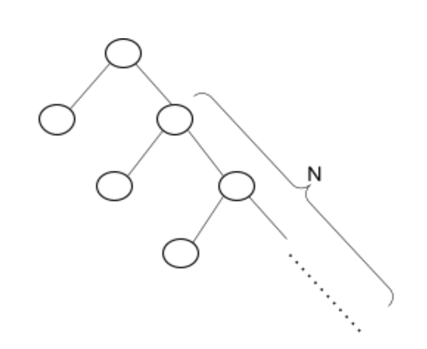
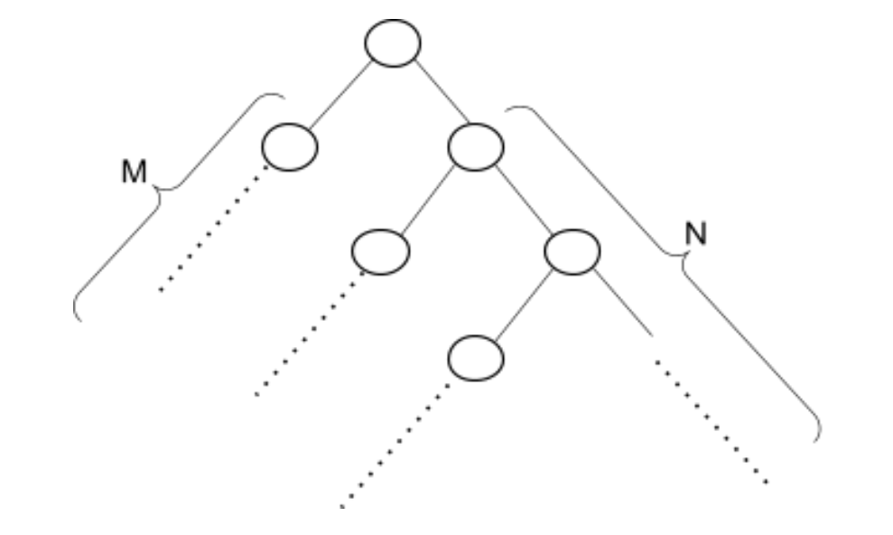

# Operating Systems Homework 1

This homework is about fork call. fork() call creates processes.
## Compiling Code
Makefile written for this code. So you can compile it like below:
```bash
cd ./hw1
make
```

## Usage

This homework contains 2 question. 

### Question 1
In first question we should create a process tree like below figure:


You can run q1 with this command: 


```bash

Usage: ./q1 <n> where n is depth of right sub-tree. n must be a positive integer.

./q1 3
```

### Question 2
In second question we should create a process tree like below figure:


You can run q2 with this command:


```bash

Usage: ./q2 <m> <n> where m is depth of left sub-tree, n is depth of right sub-tree. 
m and n must be a positive integer.

./q2 3 2
```